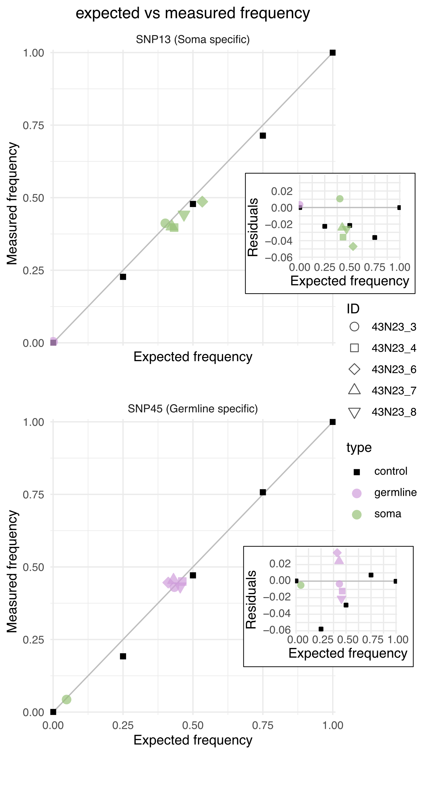

```{r setup, include=FALSE}
knitr::opts_chunk$set(echo = TRUE)

library(tidyverse)
library(readxl)

rename = dplyr::rename


samples = c("3S","4S","6S","7S","8S",
            "3L","4L","6L","7L","8L",
"100-0","75-25","50-50","25-75","0-100")


mushrooms = c("43N23_3", "43N23_4", "43N23_6", "43N23_7","43N23_8")
shapes  = c(21,22,23,24,25)
names(shapes) = mushrooms

types = c("soma","germline","control")
colors = c("#96c176ff","#cf9ddbff","#000000FF")
names(colors) = types
  
order = c("100-0","75-25","50-50","25-75","0-100",
          "43N23_3", "43N23_4", "43N23_6", "43N23_7","43N23_8")
```
**Digital PCR** is an independent method, used in addition to read depth, to determine the distribution of single nucleotide polymorphisms (SNPs). In this analysis, two specific mutations—**SNP13** and **SNP45**—were studied, which are exclusive to either the germline or somatic cells based on short-read sequencing data.

The code for the analysis was first done by Peter Jan rewritten by Johan. In this process, we load all the digital PCR data, which includes technical replicates for the samples **43N23_3**, **43N23_4**, **43N23_6**, **43N23_7**, and **43N23_8**.

For the germline-specific SNP, there are five biological replicates from the germline and one from the soma. Conversely, for the somatic-specific SNP, there are five biological replicates from the somatic cells and one from the germline. Additionally, as a technical control, we used five different mixes containing SNPs in varying proportions: 0%, 25%, 50%, 75%, and 100% of one SNP, with the remainder being the other SNP.

# Load the data
```{r}


#change wd and load datafrane
SNP13.data <- read_excel("../../data/DNA/frequency_combined.xlsx", sheet="SNP13") %>%
  mutate(SNP = "SNP13 (Soma specific)")

SNP45.data <- read_excel("../../data/DNA/frequency_combined.xlsx", sheet="SNP45") %>%
  mutate(SNP = "SNP45 (Germline specific)")

bind_rows(SNP13.data,SNP45.data ) %>%
  mutate(type = replace(type, grepl("S",sample),"soma")) %>%
  mutate(type = replace(type, grepl("L",sample),"germline"))->
  data

# Split it up in control and biological samples

data.biological = data %>% filter(type != "control") %>%
  mutate(ID = substring(sample,1,1)) %>%
  mutate(ID = replace(ID, grepl("3",sample),"43N23_3")) %>%
  mutate(ID = replace(ID, grepl("4",sample),"43N23_4")) %>%
  mutate(ID = replace(ID, grepl("6",sample),"43N23_6")) %>%
  mutate(ID = replace(ID, grepl("7",sample),"43N23_7")) %>%
  mutate(ID = replace(ID, grepl("8",sample),"43N23_8")) 
  
  

data.control = data %>% filter(type == "control") %>%
  mutate(ID = sample)
```


## Merge the data and summarise it

Since the technical replicates are highly similar (and we only have two replicates), we decided to merge them, omitting the variation for simplicity.


```{r}

# Correct the samples to the true names 
data.biological %>%
  group_by(SNP,ID,type,experiment,expected) %>% #average of technical replicates
  summarise(measured = mean(measured)) %>%
  group_by(SNP,ID,type,expected) %>%
  summarise(mean_measured = mean(measured)) %>%
  mutate(mean_residuals = mean_measured - expected) %>%
  mutate(ID = factor(ID,levels=order))->
 data.biological 

data.control %>%
  group_by(SNP,ID,type,experiment,expected) %>% #average of technical replicates
  summarise(measured = mean(measured)) %>%
  group_by(SNP,ID,type,expected) %>%
  summarise(mean_measured = mean(measured)) %>%
  mutate(mean_residuals = mean_measured - expected) %>%
  mutate(ID = factor(ID,levels=order)) ->
 data.control 

bind_rows(data.biological,data.control)->
  data

  

```


# Plot the data


## Scatter plot

```{r calculate the }


#plotting
#scatterplot
ggplot(data = data.biological, aes(x=expected,
            y=mean_measured,
            label = ID,
            fill = type,
            color = type,
            shape = ID)) + 
  geom_abline(intercept=0, slope=1, color="grey", linewidth=0.5) + 
  geom_point(data = data.control,
             size=2, shape = 15) + ##exclude errorbar if needed
  geom_point(
             size=3, alpha = 0.7) + ##exclude errorbar if needed
  scale_y_continuous(expand=c(0.005,0.005)) + 
  scale_x_continuous(expand=c(0.005,0.005)) +
  xlab("Expected frequency") +
  ylab("Measured frequency") +
  ggtitle("expected vs measured frequency") +
  theme_minimal() +
  theme(plot.title = element_text(hjust = 0.5)) + 
  scale_color_manual(values = colors) +
  scale_fill_manual(values = colors) +
  scale_shape_manual(values = shapes) +
  facet_wrap("SNP",ncol = 1 ) ->
  scatterPlot
scatterPlot

#save as svg and png
ggsave(plot =  scatterPlot,dpi = 300,
       bg = "white",
       paste("../../results/DNA/SNP.digitalPCR.scatter.png", sep=""))
ggsave(plot =  scatterPlot, paste("../../results/DNA/SNP.digitalPCR.scatter.pdf", sep=""),
        width=5, height=6)


```


## Residual plots
```{r }


#plotting
#scatterplot
ggplot(data = data.biological, aes(x=expected,
            y=mean_residuals,
            label = ID,
            fill = type,
            color = type,
            shape = ID)) + 
  geom_hline(yintercept=0, color="grey", linewidth=0.5) +
  geom_point(data = data.control,
             size=1, shape = 15) + ##exclude errorbar if needed
  geom_point(
             size=2, alpha = 0.7) + ##exclude errorbar if needed
  scale_y_continuous(expand=c(0.005,0.005)) + 
  scale_x_continuous(expand=c(0.005,0.005)) +
  xlab("Expected frequency") +
  ylab("Residuals") + 
  theme_minimal() +
  theme(plot.title = element_text(hjust = 0.5)) + 
  scale_color_manual(values = colors) +
  scale_fill_manual(values = colors) +
  scale_shape_manual(values = shapes) +
  facet_wrap("SNP",ncol = 1 ) ->residual.plot


residual.plot

#save as svg and png
ggsave(plot = residual.plot, dpi = 300,
       bg = "white",
       paste("../../results/DNA/SNP.digitalPCR.residual.png", sep=""))
ggsave(plot = residual.plot,  paste("../../results/DNA/SNP.digitalPCR.residual.pdf", sep=""),
        width=3, height=3)
```

# Statistics

We created a linear model between the digital PCR and read distribution data for each SNP. The results show very high **R²** values, indicating a strong correlation between the two datasets. Additionally, the intercepts are close to zero, and the slopes are near one, demonstrating a nearly perfect linear relationship between the digital PCR and read depth data. These metrics confirm the high reliability of the results.


```{r} 


ggplot(data = data.biological, aes(x=expected,
            y=mean_measured,
            color = SNP)) + 
  geom_point(
             size=1, alpha = 0.7) + 
  geom_smooth(method = "lm")+
  scale_y_continuous(expand=c(0.005,0.005)) + 
  scale_x_continuous(expand=c(0.005,0.005)) +
  xlab("Expected frequency") +
  ylab("Measured frequency") +
  ggtitle("expected vs measured frequency") +
  theme_minimal() +
  theme(plot.title = element_text(hjust = 0.5)) 


# Maximum residual of a sample
data.biological %>%
  group_by(SNP) %>%
  nest() %>%  # Nest data by group
  mutate(
    # Apply linear model for each group and save the model
    model = map(data, ~ lm(mean_measured ~ expected, data = .x)),
    
    # Extract Pearson correlation for each group
    pearson_correlation = map_dbl(data, ~ cor(.x$mean_measured, .x$expected, method = "pearson")),
    
    # Extract equation for each group
    equation = unlist(map(model, ~ {
      coef <- coef(.x)
      paste0("y = ", round(coef[1], 3), " + ", round(coef[2], 3), " * x")
    }
    ))
  )%>%
  mutate(R2 = pearson_correlation*pearson_correlation) %>%
  select(SNP,equation,R2 ) ->
  linearModel

data.biological %>%
   group_by(SNP) %>%
 summarise(maxResidual = max(abs(mean_residuals)))->
  maxResidual

inner_join(linearModel,maxResidual)

```

# Figure
Final figure is saved in ```results/DNA/Figure_S6_dPCR-results.JR.png```



