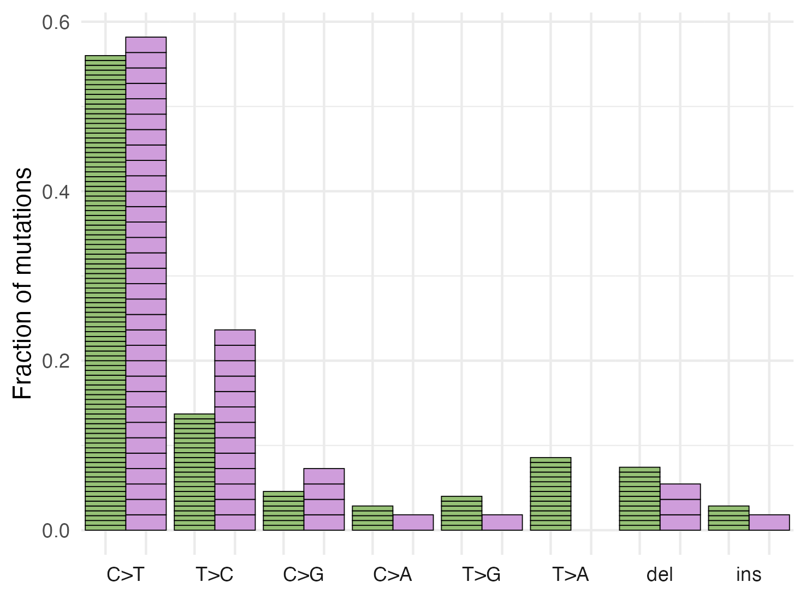
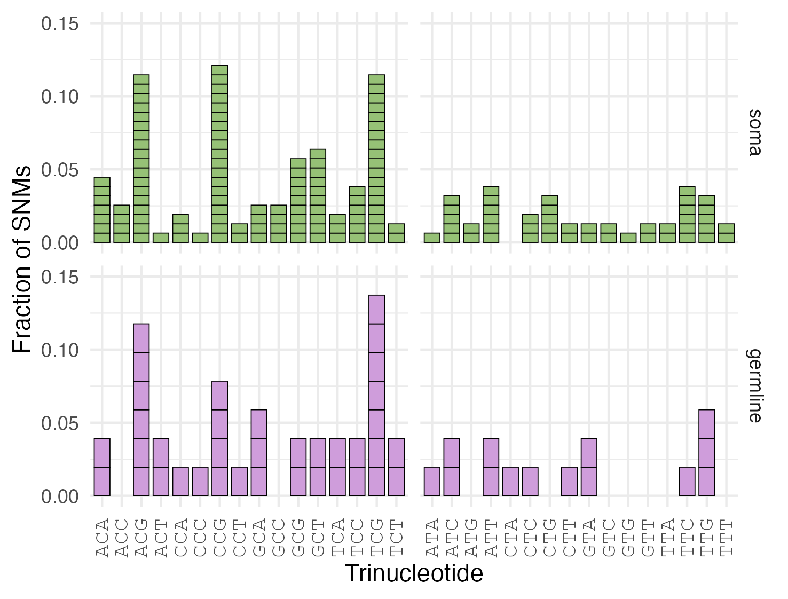

```{r setup, include=FALSE}
knitr::opts_chunk$set(echo = TRUE)

#install.packages("svglite")


#install.packages("extrafont")
#library(extrafont)
#font_import()  # Re-import fonts
#loadfonts(device = "pdf")  # or device = "pdf" if you’re using a PDF output

# Load the libraries
library(Biostrings)
library(tidyverse)
library(patchwork)


types = c("soma","germline","control")
colors = c("#96c176ff","#cf9ddbff","#000000FF")
names(colors) = types


mutationTypes =c("C>T","T>C","C>G","C>A","T>G","T>A", "del","ins")

rename = dplyr::rename
```

## Load the data

```{r,warning=FALSE,comment=FALSE}
read_tsv("../../data/DNA/mutations.v3.metadata.tsv") %>%
  filter(nchar(ref) == 1) %>%
  filter(nchar(alt) == 1) %>%
  rename(trinucleotides = "Flank") %>%
  mutate(trinucleotides = toupper(trinucleotides)) %>%
  rename(Tissue = "tissue-type") ->
  mutations.all


mutations.all %>% group_by(Tissue) %>%
  summarise(nrOfSNPs = n()) %>%
  inner_join(mutations.all) %>%
  mutate(fraction = 1/nrOfSNPs)->
  mutations.all

mutations.all%>%
  filter(ref %in% c("A","G")) %>%
  mutate(trinucleotides2 = sapply(trinucleotides, function(seq) {
    as.character(reverseComplement(DNAString(seq)))
  }))%>%
  mutate(ref2 = sapply(ref, function(seq) {
    as.character(reverseComplement(DNAString(seq)))
  })) %>%
  mutate(alt2 = sapply(alt, function(seq) {
    as.character(reverseComplement(DNAString(seq)))
  }))->
  mutations.all.reverse


mutations.all %>%
  filter(ref %in% c("T","C")) %>%
  mutate(trinucleotides2 = trinucleotides)%>%
  mutate(ref2 = ref) %>%
  mutate(alt2 = alt)->
  mutations.all.forward

mutations.all = bind_rows(mutations.all.reverse,mutations.all.forward)
```

## Check the trinucleotides

```{r}

Marasmius_DNA = Biostrings::readDNAStringSet("../../reference/GCF_018924745.1_UU_Maror_2_genomic.fna")

names = names(Marasmius_DNA)
names2 = first_words <- sub(" .*", "", names(Marasmius_DNA))
names(Marasmius_DNA) = names2


mutations.all %>%
  mutate(seq = as.character(subseq(Marasmius_DNA[CHROM],start =pos-1,end = pos+1)))  %>%
  mutate(compare = "different") %>%
  mutate(compare = replace(compare, trinucleotides == seq,"SAME")) %>%
  group_by(compare) %>%
  summarise(n = n())


```

## Figure 5e

### Code

```{R}

read_tsv("../../data/DNA/mutations.v3.metadata.tsv") %>%
  rename(trinucleotides = "Flank") %>%
  mutate(trinucleotides = toupper(trinucleotides)) %>%
  rename(Tissue = "tissue-type") %>%
  mutate(type = gsub("DEL","del",type)) %>%
  mutate(type = gsub("INS","ins",type)) ->
  mutations.all.2


mutations.all.2 %>% group_by(Tissue) %>%
  summarise(nrOfSNPs = n()) %>%
  inner_join(mutations.all.2) %>%
  mutate(fraction = 1/nrOfSNPs)->
  mutations.all.2
order = c("soma","germline")

mutations.all.2 %>% 
  mutate(Tissue = factor(Tissue, levels = order )) %>%
  mutate(type = factor(type, levels=mutationTypes)) %>%
  ggplot(aes(x=Tissue, y = fraction, fill = Tissue))+ 
  geom_bar(stat = "identity", width = 1, color = "black", size = 0.2)+
  ylab("Fraction of mutations") +
  theme_minimal() +
  scale_fill_manual(values = colors) +
  theme(axis.text.x = element_text(family = "mono",size = 10,angle = 90, hjust = 1, vjust = 0.5),
  ) +
  facet_grid(.~type, switch = "x")+
  theme(
    panel.margin = grid::unit(-0.0, "lines"),
    axis.text.x = element_blank(),      # Remove x-axis text
    axis.title.x = element_blank(),      # Remove x-axis title if desired
    legend.position = "none"            # Remove legend
  ) ->
  figure5_e


ggsave("../../results/DNA/Figure_5e.png",
       width =125,height = 95,
       units = "mm",dpi = 300, 
       plot = figure5_e, , bg = "white" )

ggsave("../../results/DNA/Figure_5e.svg",
       width =4,height = 3, 
       plot = figure5_e)

ggsave("../../results/DNA/Figure_5e.pdf",
       width =8,height = 6, 
       plot = figure5_e)


ggsave("../../results/DNA/Figure_5e_2.pdf",
       width =4,height = 3, 
       plot = figure5_e)


```

### Final figure

Final figure is saved in `results/DNA/Figure_5e.png`



## Figure 5f

### Code

```{r}


mutationTypes
order = c("soma","germline")
mutations.all %>% 
  mutate(Tissue = factor(Tissue, levels = order )) %>%
  ggplot(aes(x=trinucleotides2, y = fraction, fill = Tissue))+ 
  geom_bar(stat = "identity", width = 0.8, color = "black", size = 0.2)+
  xlab("Trinucleotide") +
  ylab("Fraction of SNMs") +
  theme_minimal() +
  scale_fill_manual(values = colors) +
  theme(axis.text.x = element_text(family = "mono",size = 10,angle = 90, hjust = 1, vjust = 0.5),
        legend.position = "none",            # Remove legend
        strip.text.x = element_blank(),  # Customize facet label text size
  ) +
  facet_grid(Tissue~ref2, scales = "free_x") + 
  scale_y_continuous(expand=c(0,0.05)) + ylim(c(0,0.15))->
  mutations.fig.5f


ggsave("../../results/DNA/Figure_5f.png",
       width =125,height = 95,
       units = "mm",dpi = 300, 
       plot = mutations.fig.5f, bg = "white" )

ggsave("../../results/DNA/Figure_5f.svg",
       width =4,height = 3, 
       plot = mutations.fig.5f)

ggsave("../../results/DNA/Figure_5f.pdf",
       width =8,height = 6, 
       plot = mutations.fig.5f)


ggsave("../../results/DNA/Figure_5f_2.pdf",
       width =4,height = 3, 
       plot = mutations.fig.5f)

```

### Chi square test for simliarities and differences in tri nucleotide distribution

```{r qhiSquare test}
mutations.all  %>%
  group_by(Tissue,ref2, trinucleotides2) %>%
  summarise(n = n()) %>%
  pivot_wider(names_from = "Tissue", values_from = "n", values_fill = 0 ) ->
  mutations.all.summary

mutations.all.summary %>%
  ungroup() %>%
  select(-ref2) %>%
  column_to_rownames("trinucleotides2") %>%
  chisq.test( simulate.p.value = TRUE)

mutations.all.summary %>%
  filter(ref2 == "C") %>%
  ungroup() %>%
  select(-ref2) %>%
  column_to_rownames("trinucleotides2") %>%
  chisq.test( simulate.p.value = TRUE)

mutations.all.summary %>%
  filter(ref2 == "T") %>%
  ungroup() %>%
  select(-ref2) %>%
  column_to_rownames("trinucleotides2") %>%
  chisq.test( simulate.p.value = TRUE)


```

### Final figure

Final figure is saved in `results/DNA/Figure_5f.png`



## Legend

**Genomic distribution, spectrum, and base context of mutations. a,** Cumulative fraction of mutations across chromosomes, scaled by length and centered at the midpoint coordinate (0). On the x-axis, a negative value indicates a direction towards the 5’ and a positive value towards the 3’ end of the chromosome. The grey line indicates the expectation under a uniform distribution. **b,** Number of mutations per chromosome, scaled by the chromosome length. **c,** Fraction of mutations in coding and non-coding regions of the genome. **d**, Fraction of mutations phased to the nucleotypes A and B. **e,** Base spectrum of mutations, scaled by the total number of mutations per tissue type. Mutations at complementary bases are counted together. Ts: transition, Tv: transversion. **f,** Base context around Single-Nucleotide Mutations (SNMs; i.e., not counting indels), centered on the mutated base and complementary bases are counted together. Numbers are scaled by the total number of SNMs per tissue type. Left panels: mutations at C:G sites, right panels: mutations at T:A sites. Through all subpanels, green indicates somatic mutations and purple indicates germline mutations.
