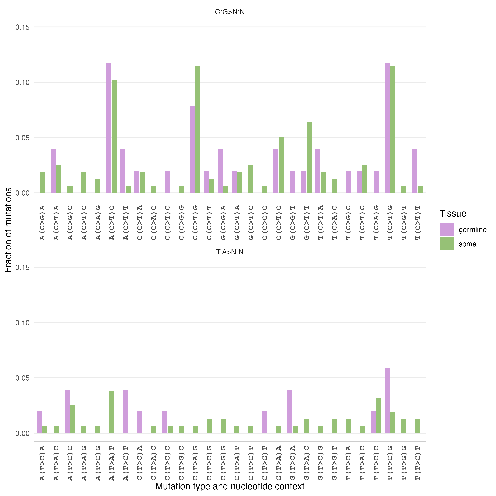

```{r setup, include=FALSE}
knitr::opts_chunk$set(echo = TRUE)

#install.packages("svglite")


#install.packages("extrafont")
#library(extrafont)
#font_import()  # Re-import fonts
#loadfonts(device = "pdf")  # or device = "pdf" if you’re using a PDF output

# Load the libraries
library(Biostrings)
library(tidyverse)
library(patchwork)


types = c("soma","germline","control")
colors = c("#96c176ff","#cf9ddbff","#000000FF")
names(colors) = types


mutationTypes =c("C>T","T>C","C>G","C>A","T>G","T>A", "del","ins")

rename = dplyr::rename
```

# Supplementary figures

## Supp figure 1

### Data

No data

### Code

No code

### Legend

Full sampling map drawn to approximate scale. During 2016 (n = 16) and
2018 (n = 3), precise locations of fruiting bodies were not recorded,
instead resorting to the general cardinal or intercardinal direction.
Radius distances are shown in cm.

## Supp figure 2

### Data

No data

### Code

No code

### Legend

Confirmation of mutations by Sanger sequencing. In this example,
mutation M10 was amplified and sequenced in tissues of fruiting body
2021-N5. The arrow points to the site that was mutated in the stipe
(bottom two panels).

## Supp figure 3

### Data

No data

### Code

No code 

### Legend 
Frequencies of mutations in fruiting bodies with
detailed dissections.

## Supp figure 4

### Data

No data 

### Code

No code 

### Legend

Maximum parsimony tree of all
identified mutations in ring 43. Green highlighting: stipe samples,
purple: lamella samples.

## Supp figure 5

### Data

No data

### Code

No code 

### Legend 
Distribution of allelic fractions of ancestral variants in ring 43 (left; n = 134,863) and ring 06 (right; n = 138,269) after filtering.


## Supp figure 6

### Data

No data

### Code

No code 

### Legend 
 a. Maximum parsimony tree of variants in germline samples with a frequency > 0.4. The tree is rooted on sample 43SW23_1, which has no variants. From this tree, 11 monophyletic groups were identified containing 15 unique samples. b. Maximum parsimony tree of variants in germline samples with a frequency > 0.4. The tree is rooted on sample 43SW23_1, which has no variants. From this tree, 11 monophyletic groups were identified containing 21 unique samples


## Supp figure 7

### Data

No data

### Code

No code 

### Legend 
Verification of allelic fractions by digital PCR (dPCR) of mutations SNP13 and SNP45. DNA from stipes (S) and lamellae (L) of fruiting bodies N23-3, N23-4, N23-6, N23-7, N23-8 (same extractions as were used for sequencing), and mixtures of synthetic sequences of the wildtype and mutation at different ratios (100-0, etc.; Table S3) were included. In each experiment, a sample of the opposite tissue type (i.e., L for SNP13 that was found in S samples) was included as a control. Expected frequencies (controls: ratios of synthetic sequences; samples: predicted ratios from sequencing data) were plotted against empirical ratios from dPCR. Insets: residuals of the measured minus expected frequencies. a, SNP13, present in stipe samples; b, SNP45, present in lamellae.

## Supp figure 8

### Data

```{r,warning=FALSE,comment=FALSE}
read_tsv("../../data/DNA/mutations.v3.metadata.tsv") %>%
  filter(nchar(ref) == 1) %>%
  filter(nchar(alt) == 1) %>%
  rename(trinucleotides = "Flank") %>%
  mutate(trinucleotides = toupper(trinucleotides)) %>%
  rename(Tissue = "tissue-type") ->
  mutations.all


mutations.all %>% group_by(Tissue) %>%
  summarise(nrOfSNPs = n()) %>%
  inner_join(mutations.all) %>%
  mutate(fraction = 1/nrOfSNPs)->
  mutations.all

mutations.all%>%
  filter(ref %in% c("A","G")) %>%
  mutate(trinucleotides2 = sapply(trinucleotides, function(seq) {
    as.character(reverseComplement(DNAString(seq)))
  }))%>%
  mutate(ref2 = sapply(ref, function(seq) {
    as.character(reverseComplement(DNAString(seq)))
  })) %>%
  mutate(alt2 = sapply(alt, function(seq) {
    as.character(reverseComplement(DNAString(seq)))
  }))->
  mutations.all.reverse


mutations.all %>%
  filter(ref %in% c("T","C")) %>%
  mutate(trinucleotides2 = trinucleotides)%>%
  mutate(ref2 = ref) %>%
  mutate(alt2 = alt)->
  mutations.all.forward

mutations.all = bind_rows(mutations.all.reverse,mutations.all.forward)
```

### Code

```{r}

mutations.all %>% arrange(ref2,trinucleotides2) -> mutations.snp.order

mutations.snp.order %>%distinct(trinucleotides2)->order
mutations.all %>% mutate(trinucleotides2 = factor(trinucleotides2,order$trinucleotides2))  ->
  mutations.all


mutations.all %>% arrange(trinucleotides2,Tissue) %>%
  mutate(name = paste(substring(trinucleotides2,1,1),"(",type,")",substring(trinucleotides2,3,3) ,sep = "" )) ->  mutations.all

mutations.all %>% distinct(trinucleotides2,ref2,alt2,name) %>%
  arrange(ref2,trinucleotides2,alt2) -> order


mutations.all %>% mutate(name = factor(name, levels = order$name)) ->mutations.all

mutations.all %>% 
  group_by(ref2,Tissue, name) %>%
  summarise(fraction = sum(fraction)) %>%
  mutate(ref3 = "C:G>N:N" )%>%
  mutate(ref3 = replace(ref3, ref2 == "T","T:A>N:N")) %>%
  ggplot(aes(x=name, y = fraction, fill = Tissue))+ 
  geom_bar(stat = "identity",position = position_dodge2(preserve = "single",), width = 0.8)+
  
  xlab("Mutation type and nucleotide context") +
  ylab("Fraction of mutations") +
  theme_minimal() +
  scale_fill_manual(values = colors) +
  theme(axis.text.x = element_text(face = "bold",family = "mono",size = 10,angle = 90, hjust = 1, vjust = 0.5),
        panel.grid.major.x = element_blank(), # Remove major vertical grid lines
        panel.grid.minor.x = element_blank(),  # Remove minor vertical grid lines
        panel.grid.minor.y = element_blank(),  # Remove minor vertical grid lines
        panel.border = element_rect(color = "black", fill = NA, size = 0.5)  # Border around the entire plot
  ) +
  facet_wrap(ref3~., scales = "free_x", ncol = 1) + 
  scale_y_continuous(expand=c(0,0.05)) + ylim(c(0,0.15))->
  mutations.fig.S8


mutations.fig.S8

ggsave("../../results/DNA/Figure_S8.png",
       width =210,height = 210,
       units = "mm",dpi = 300, 
       plot = mutations.fig.S8, , bg = "white" )

ggsave("../../results/DNA/Figure_S8.svg",
       width =4,height = 3, 
       plot = mutations.fig.S8)


ggsave("../../results/DNA/Figure_S8.pdf",
       width =8,height = 10, 
       plot = mutations.fig.S8)


```

### Final figure

Final figure is saved in `results/DNA/Figure_S8.png`



### Legend

## Supp figure 9

### Data

```{r,warning=FALSE,comment=FALSE}
read_tsv("../../data/DNA/mutations.v3.metadata.tsv") %>%
  filter(nchar(ref) == 1) %>%
  filter(nchar(alt) == 1) %>%
  rename(trinucleotides = "Flank") %>%
  mutate(trinucleotides = toupper(trinucleotides)) %>%
  rename(Tissue = "tissue-type") ->
  mutations.all


mutations.all %>% group_by(Tissue) %>%
  summarise(nrOfSNPs = n()) %>%
  inner_join(mutations.all) %>%
  mutate(fraction = 1/nrOfSNPs)->
  mutations.all

mutations.all%>%
  filter(ref %in% c("A","G")) %>%
  mutate(trinucleotides2 = sapply(trinucleotides, function(seq) {
    as.character(reverseComplement(DNAString(seq)))
  }))%>%
  mutate(ref2 = sapply(ref, function(seq) {
    as.character(reverseComplement(DNAString(seq)))
  })) %>%
  mutate(alt2 = sapply(alt, function(seq) {
    as.character(reverseComplement(DNAString(seq)))
  }))->
  mutations.all.reverse


mutations.all %>%
  filter(ref %in% c("T","C")) %>%
  mutate(trinucleotides2 = trinucleotides)%>%
  mutate(ref2 = ref) %>%
  mutate(alt2 = alt)->
  mutations.all.forward

mutations.all = bind_rows(mutations.all.reverse,mutations.all.forward)
```

### Code

```{r}

mutations.all %>% arrange(ref2,trinucleotides2) -> mutations.snp.order

mutations.snp.order %>%distinct(trinucleotides2)->order
mutations.all %>% mutate(trinucleotides2 = factor(trinucleotides2,order$trinucleotides2))  ->
  mutations.all


mutations.all %>% arrange(trinucleotides2,Tissue) %>%
  mutate(name = paste(substring(trinucleotides2,1,1),"(",type,")",substring(trinucleotides2,3,3) ,sep = "" )) ->  mutations.all

mutations.all %>% distinct(trinucleotides2,ref2,alt2,name) %>%
  arrange(ref2,trinucleotides2,alt2) -> order


mutations.all %>% mutate(name = factor(name, levels = order$name)) ->mutations.all

mutations.all %>% 
  group_by(ref2,Tissue, name) %>%
  summarise(fraction = sum(fraction)) %>%
  mutate(ref3 = "C:G>N:N" )%>%
  mutate(ref3 = replace(ref3, ref2 == "T","T:A>N:N")) %>%
  ggplot(aes(x=name, y = fraction, fill = Tissue))+ 
  geom_bar(stat = "identity",position = position_dodge2(preserve = "single",), width = 0.8)+
  
  xlab("Mutation type and nucleotide context") +
  ylab("Fraction of mutations") +
  theme_minimal() +
  scale_fill_manual(values = colors) +
  theme(axis.text.x = element_text(face = "bold",family = "mono",size = 10,angle = 90, hjust = 1, vjust = 0.5),
        panel.grid.major.x = element_blank(), # Remove major vertical grid lines
        panel.grid.minor.x = element_blank(),  # Remove minor vertical grid lines
        panel.grid.minor.y = element_blank(),  # Remove minor vertical grid lines
        panel.border = element_rect(color = "black", fill = NA, size = 0.5)  # Border around the entire plot
  ) +
  facet_wrap(ref3~., scales = "free_x", ncol = 1) + 
  scale_y_continuous(expand=c(0,0.05)) + ylim(c(0,0.15))->
  mutations.fig.S8


mutations.fig.S8

ggsave("../../results/DNA/Figure_S8.png",
       width =210,height = 210,
       units = "mm",dpi = 300, 
       plot = mutations.fig.S8, , bg = "white" )

ggsave("../../results/DNA/Figure_S8.svg",
       width =4,height = 3, 
       plot = mutations.fig.S8)


ggsave("../../results/DNA/Figure_S8.pdf",
       width =8,height = 10, 
       plot = mutations.fig.S8)


```

### Final figure

Final figure is saved in `results/DNA/Figure_S9.png`


### Legend

