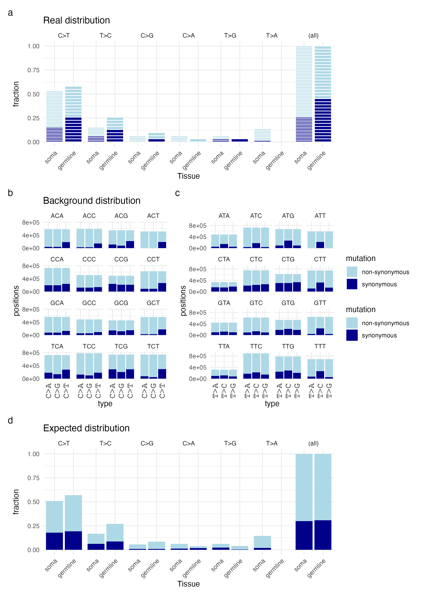

```{r setup, include=FALSE}
knitr::opts_chunk$set(echo = TRUE)

# Load the libraries
library(Biostrings)
library(seqinr)
library(GenomicRanges)
library(GenomicFeatures)
library(tidyverse)
library(patchwork)


rename = dplyr::rename
select = dplyr::select


colors_syn = c("lightblue","darkblue")

```


##  Step 1: Loading references
In this step, we read the FASTA file and convert it into a tibble for easier manipulation. We assume that all sequences in the FASTA file are coding sequences.

### Fasta reference
```{r step 1 genome,warning=FALSE,comment=FALSE}
Marasmius_DNA = Biostrings::readDNAStringSet("../../reference/GCF_018924745.1_UU_Maror_2_genomic.fna")


class(Marasmius_DNA)

names = names(Marasmius_DNA)
names2 = first_words <- sub(" .*", "", names(Marasmius_DNA))
names(Marasmius_DNA) = names2


```


### Gff reference
```{r step 1 gff,warning=FALSE,comment=FALSE}

gtfFile = "../../annotation/GCF_018924745.1_UU_Maror_2_genomic.gff"	


txdb <- makeTxDbFromGFF(file=gtfFile, dataSource="ensemblgenomes",format = "gff3")

```


### CDS fasta references
```{r load cds,warning=FALSE,comment=FALSE}
# Load the multi-FASTA file
fasta_file <- "../../reference/GCF_018924745.1_UU_Maror_2_cds.fna"
sequences <- readDNAStringSet(fasta_file, format="fasta")
names = names(sequences)

xp_identifiers <- map(names, ~str_extract(.x, "XP_\\d+\\.\\d+"))

xp_identifiers <- unlist(xp_identifiers)

length(names)
length(xp_identifiers)

names(sequences) = xp_identifiers
# Convert to tibble for easier manipulation
sequences_tbl <- tibble(
  name = names(sequences),
  sequence = as.character(sequences)
)

# Preview the first few sequences
cds_sequences_tbl <- sequences_tbl %>%
  mutate(sequence = toupper(sequence))

```


#### Bad sequences?
This is sequences where the length of the sequence is not dividable by three and get a integer number. Indicative of something wrong with the extraction of the sequence
```{r bad sequences,warning=FALSE,comment=FALSE}
sequences_tbl %>% 
  mutate(length = nchar(sequence)) %>%
  mutate(mod = length %% 3) %>%
  filter(mod != 0) ->
  notATriMer

notATriMer


```


## Step 2: Trinucleotide Context Analysis
In this step, we break down each sequence into its trinucleotide contexts (three consecutive nucleotides) and count their occurrences.


### Step 2.1 Create all potential mutations from a trimer
```{r step2.1,warning=FALSE,comment=FALSE}
# Load necessary package

# Define the nucleotide bases
nucleotides <- c("A", "T", "C", "G")

# Step 1: Generate all possible nucleotide trimers
# Expand grid to get all combinations of nucleotides in three positions
trimers <- expand.grid(n1 = nucleotides, n2 = nucleotides, n3 = nucleotides) %>%
  mutate(trimer = paste0(n1, n2, n3)) %>%
  dplyr::select(trimer)

# Step 2: Generate mutations for all three positions and add position info
generate_mutations_all_positions <- function(trimer) {
  # Split the trimer into its nucleotides
  trimer_split <- strsplit(trimer, "")[[1]]
  
  # Initialize an empty tibble to store mutated trimers
  mutated_trim_df <- tibble()

  # Loop through each position (1st, 2nd, 3rd)
  for (pos in 1:3) {
    # Mutate the nucleotide at the current position
    for (mut in setdiff(nucleotides, trimer_split[pos])) {
      mutated_codon <- trimer_split
      mutated_codon[pos] <- mut
      mutated_trim_df <- bind_rows(mutated_trim_df, 
                                   tibble(codon = trimer, 
                                          mutated_codon = paste0(mutated_codon, collapse = ""),
                                          codonPos = paste0("Position ", pos),
                                          nt = trimer_split[pos], mutated_nt = mut))
    }
  }
  
  # Return the original trimer, mutated trimer, and position info
  return(mutated_trim_df)
}

# Apply the mutation function to all trimers
mutations_df <- trimers %>%
  rowwise() %>%
  do(generate_mutations_all_positions(.$trimer)) %>%
  ungroup()

# Convert mutated_codon and codonPos to character if necessary
mutations_df <- mutations_df %>%
  mutate(mutated_codon = as.character(mutated_codon),
         codonPos = as.character(codonPos))

as.data.frame(getGeneticCode()) %>%
  rownames_to_column(var= "codon") %>%
  rename(aa = "getGeneticCode()") -> 
  nt2aa

nt2aa %>%
  rename(mutated_codon = "codon") %>%
  rename(mutated_aa = "aa")-> nt2aa.mut

mutations_df %>% inner_join(nt2aa) %>%
  inner_join(nt2aa.mut) %>%
  mutate(mutation = "non-synonymous") %>%
  mutate(mutation = replace(mutation, aa == mutated_aa, "synonymous")) ->
  mutations_df


mutations_df

```

### Step 2.2 Extract all trimers from the cds

```{r  step 2.2,warning=FALSE,comment=FALSE}
# Function to extract trinucleotides from a sequence
extract_trinucleotides <- function(sequence) {
  str_sub(sequence, seq(1, nchar(sequence) - 2, 1), seq(3, nchar(sequence), 1))
}

# Create a tibble with trinucleotide counts for each sequence

  
cds_sequences_tbl %>%
  rowwise() %>%
  mutate(trinucleotides = list(extract_trinucleotides(sequence))) %>%
  unnest(trinucleotides) %>%
  group_by(name) %>%
  mutate(pos = 1:n()) %>%
  ungroup() %>%
  mutate(codonPos = pos+1) %>%
  mutate(codonPos = codonPos%%3) %>%
  mutate(codonPos = replace(codonPos,codonPos == 1, "Position 1")) %>%
  mutate(codonPos = replace(codonPos,codonPos == 2, "Position 2")) %>%
  mutate(codonPos = replace(codonPos,codonPos == 0, "Position 3")) %>% 
  filter(!name %in% notATriMer$name)%>%
  mutate(codonNr = floor(pos/3)) -> 
  trinucleotide_tbl

trinucleotide_tbl %>%
  filter(codonPos == "Position 2") %>%
  mutate(codon = trinucleotides) %>%
  select(name,codonNr,codon) %>%
  inner_join(trinucleotide_tbl) %>%
  select(name,codonNr,codon,codonPos,trinucleotides) -> 
  cds.codons
```


### Step 2.3 Join the mutation patters and the trimers
```{r step 2.3,warning=FALSE,comment=FALSE}

cds.codons %>% inner_join(mutations_df) ->cds.codons


cds.codons %>% 
  group_by(codon,mutation,codonPos) %>%
  summarise(n = n() )

  
```


## Step 3: pN/pS Ratio for the different trimers in the cDNA data
In this section, we calculate the non-synonymous (pN) and synonymous (pS) mutations based on the genetic code. We compare each codon with all possible codons to determine if a mutation is synonymous or non-synonymous.


```{r step4,warning=FALSE,comment=FALSE}


cds.codons %>% group_by(trinucleotides,mutation,codonPos,nt,mutated_nt) %>%
  summarise(n=n())->cds.codons.summary


cds.codons.summary %>% pivot_wider(names_from = mutation,values_from = n, values_fill = 0) %>%
  mutate(total = `non-synonymous` + synonymous) %>%
  mutate(total2 = total /3) ->
  cds.codons.summary.2
  

cds.codons.summary.2 %>%
  select(-total, -total2)%>% 
  pivot_longer(c(`non-synonymous`, `synonymous`),names_to = "mutation", values_to = "present") %>%
  mutate(nt = substr(trinucleotides, 2, 2)) ->
  cds.codons.summary.3

backgroundPlots = list()
for(nts in nucleotides){
cds.codons.summary.3 %>% filter(nt == nts) %>%
    rename(fraction = "present") %>%
  ggplot(aes(x = trinucleotides, y = fraction, fill = mutation)) + 
    geom_bar(stat = "identity",position = "fill")+
  theme(axis.text.x = element_text(angle = 45, hjust = 1)) + facet_wrap("nt") ->
    plot
  backgroundPlots[[nts]] = plot
}

backgroundPlots$A+
  backgroundPlots$C+
  backgroundPlots$G+
  backgroundPlots$T + 
  plot_layout(guides = "collect")


cds.codons.summary %>%
  filter(nt %in% c("A","G")) %>%
  mutate(trinucleotides2 = sapply(trinucleotides, function(seq) {
    as.character(reverseComplement(DNAString(seq)))
  }))%>%
  mutate(nt2 = sapply(nt, function(seq) {
    as.character(reverseComplement(DNAString(seq)))
  }))%>%
  mutate(mutated_nt2 = sapply(mutated_nt, function(seq) {
    as.character(reverseComplement(DNAString(seq)))
  }))->
  reverse
cds.codons.summary %>%
  filter(nt %in% c("T","C")) %>%
  mutate(trinucleotides2 = trinucleotides)%>%
  mutate(mutated_nt2 = mutated_nt)%>%
  mutate(nt2 = nt)->
  forward


bind_rows(forward,reverse) %>%
  mutate(type = paste(nt2,">",mutated_nt2 , sep = ""))-> cds.codons.summary.4


cds.codons.summary.4 %>% group_by(trinucleotides2, nt2, mutated_nt2,type,codonPos,mutation) %>%
  summarise(positions = sum(n)) -> cds.codons.summary.4

backgroundPlots = list()
for(nts in c("T","C")){
cds.codons.summary.4 %>% filter(nt2 == nts) %>%
  ggplot(aes(x = type, y = positions, fill = mutation)) + 
    geom_bar(stat = "identity")+
  scale_fill_manual(values = colors_syn) +
  scale_alpha_manual(values = c(0.6,0.8,1)) +
  theme_minimal()+
  ylim(c(0,800000))+ 
  theme(axis.text.x = element_text(family = "Courier",size = 12,angle = 90, hjust = 1, vjust = 0.5)) + facet_wrap("trinucleotides2") ->
    plot
  backgroundPlots[[nts]] = plot
}

backgroundPlots$C+
  backgroundPlots$T + 
  plot_layout(guides = "collect")

```


### Step 4.1 Only with the CDS mutations
```{r,warning=FALSE,comment=FALSE}
read_tsv("../../data/DNA/mutations.v3.metadata.tsv") %>%
  filter(nchar(ref) == 1) %>%
  filter(nchar(alt) == 1) %>%
  rename(trinucleotides = "Flank") %>%
  mutate(trinucleotides = toupper(trinucleotides)) %>%
  rename(Tissue = "tissue-type") %>%
  filter(`CDS/NCDS` == "CDS")->
  mutations.cds
 


readxl::read_xlsx(path = "../../data/DNA/Data_S2.xlsx")%>%
  filter(nchar(`Reference allele`) == 1) %>%
  filter(nchar(`Alternate allele`) == 1) %>%
  rename(trinucleotides = "Flank") %>%
  mutate(trinucleotides = toupper(trinucleotides)) %>%
  rename(ref = "Reference allele") %>%
  rename(alt = "Alternate allele") %>%
  rename(CHROM = "Chromosome") %>%
  rename(pos = "Coordinate") %>%
  rename(`present-in-pop` = "Present in population") %>%
  rename(type = "Type") %>%
filter(`CDS/NCDS` == "CDS")  %>%
  select(CHROM,pos,ref,alt,Tissue,trinucleotides,type,`Syn/Nonsyn`)->
  mutations.cds2


mutations.cds2 %>%
  ggplot(aes(x = Tissue, fill = `Syn/Nonsyn`)) + 
  geom_bar(position = "fill")

full_join(mutations.cds,mutations.cds2)  %>%
  arrange(CHROM,pos) -> mutations.cds


mutations.cds %>%
  mutate(seq = as.character(subseq(Marasmius_DNA[CHROM],start =pos-1,end = pos+1)))  %>%
  mutate(compare = "different") %>%
  mutate(compare = replace(compare, trinucleotides == seq,"SAME")) %>%
  group_by(compare) %>%
  summarise(n = n())

```

```{r}


  
mutations.cds %>% group_by(ref,alt,trinucleotides,Tissue) %>%
  summarise(n = n()) -> 
  mutation.pattern
mutation.pattern %>% group_by(Tissue) %>%
  summarise(sum = sum(n)) %>% 
  inner_join(mutation.pattern) %>%
  mutate(fraction = n/sum)->
  mutation.pattern 
mutation.pattern


cds.codons%>% 
  mutate(pos = as.numeric(substr(codonPos,10,10))) %>%
  mutate(ref= substr(codon, pos, pos)) %>%
  mutate(alt = substr(mutated_codon, pos, pos)) %>%
  group_by(trinucleotides,ref, alt,mutation) %>%
  summarise(n = n()) ->
  cds.codons.distributions


mutations.cds %>%
  inner_join(cds.codons.distributions) %>%
  arrange(trinucleotides,ref,alt,Tissue) ->
  mutations.snp


mutations.snp%>%
  filter(ref %in% c("A","G")) %>%
  mutate(trinucleotides2 = sapply(trinucleotides, function(seq) {
    as.character(reverseComplement(DNAString(seq)))
  }))%>%
  mutate(ref2 = sapply(ref, function(seq) {
    as.character(reverseComplement(DNAString(seq)))
  })) %>%
  mutate(alt2 = sapply(alt, function(seq) {
    as.character(reverseComplement(DNAString(seq)))
  }))->
  mutations.snp.reverse
mutations.snp %>%
  filter(ref %in% c("T","C")) %>%
  mutate(trinucleotides2 = trinucleotides)%>%
  mutate(ref2 = ref) %>%
  mutate(alt2 = alt)->
  mutations.snp.forward

mutations.snp = bind_rows(mutations.snp.reverse,mutations.snp.forward)


```

#### Step 4.1.1 Trimers with changes 
```{r ,warning=FALSE,comment=FALSE, fig.height = 8, fig.width = 6}


mutations.snp %>% arrange(ref2,trinucleotides2) -> mutations.snp.order

mutations.snp.order %>%distinct(trinucleotides2)->order
mutations.snp %>% mutate(trinucleotides2 = factor(trinucleotides2,order$trinucleotides2))  ->
  mutations.snp

mutations.snp %>% 
  ggplot(aes(x=trinucleotides2,  fill = mutation))+ 
    geom_bar()+
  theme(axis.text.x = element_text(angle = 90, hjust = 1, vjust = 0.5)) +
  facet_wrap(c("Tissue"), ncol = 1)


mutations.snp %>% 
  ggplot(aes(x=trinucleotides2, y = n, fill = mutation))+ 
    geom_bar(stat = "identity")+
  theme(axis.text.x = element_text(angle = 90,family = "Courier", size = 12, hjust = 1, vjust = 0.5)) +
  facet_wrap(c("Tissue"))


```

#### Step 4.1.2 Trimers indepent of changes
```{r, fig.height = 10, fig.width = 6 }

mutations.snp %>% 
  ggplot(aes(x=Tissue, y = n, fill = mutation))+ 
    geom_bar(stat = "identity")+
  theme(axis.text.x = element_text(angle = 45, hjust = 1)) +
  facet_wrap("trinucleotides")

mutations.snp %>%  
  distinct(CHROM,pos,Tissue,trinucleotides,`Syn/Nonsyn`) %>%
  ggplot(aes(x=trinucleotides,  fill = `Syn/Nonsyn`))+ 
    geom_bar()+
  theme(axis.text.x = element_text(angle = 45, hjust = 1)) +
  facet_wrap("Tissue",ncol = 1)


```


#### Step 4.1.3 All sites
```{r ,warning=FALSE,comment=FALSE, fig.height = 6, fig.width = 6}

mutations.snp %>% group_by(Tissue) %>%
  summarise(sum = sum(n)) %>%
  inner_join(mutations.snp) %>%
  mutate(fraction = n/sum) -> mutations.snp

types =c("C>T","T>C","C>G","C>A","T>G","T>A")
unique(mutations.snp$Tissue)
to = c("soma","germline")


mutations.snp %>%
  mutate(type = factor(type, levels = types)) %>%
  mutate(Tissue = factor(Tissue, levels = to)) %>%
  ggplot(aes(x=Tissue, y = fraction, fill = mutation))+ 
    geom_bar(stat = "identity") +
  facet_grid(.~type,margins = TRUE)  +
  scale_fill_manual(values = colors_syn) +
  theme_minimal()+
    theme(axis.text.x = element_text(angle = 45, hjust = 1))+
  theme(panel.margin = grid::unit(-0.0, "lines")) + ggtitle("Expected distribution")-> 
  fraction.background


```


```{r}
mutations.snp %>% 
  distinct(CHROM,pos,Tissue,trinucleotides,`Syn/Nonsyn`,type)  -> 
  mutations.snp.real


  mutations.snp.real%>%
  group_by(Tissue) %>%
  summarise(numberOfMutations = n()) %>%
  inner_join(mutations.snp.real) %>%
  distinct(CHROM,pos,Tissue,trinucleotides,type,`Syn/Nonsyn`,numberOfMutations)  %>%
  mutate(fraction = 1/numberOfMutations) -> mutations.snp.real

  


colors = c("lightblue","darkblue")

mutations.snp.real %>%
  mutate(type = factor(type, levels = types)) %>%
  mutate(Tissue = factor(Tissue, levels = to)) %>%
  mutate(mutation = `Syn/Nonsyn`) %>%
  mutate(mutation = gsub("nonsyn","non-synonymous",mutation)) %>%
  mutate(mutation = replace(mutation, mutation == "syn","synonymous")) %>%
  ggplot(aes(x=Tissue, y = fraction, fill = mutation))+ 
    geom_bar(stat = "identity", color = "white", size = 0.1) +
  facet_grid(.~type,margins = TRUE)  +
  scale_fill_manual(values = colors) +
  theme_minimal()+
    theme(axis.text.x = element_text(angle = 45, hjust = 1))+
  theme(panel.margin = grid::unit(-0.0, "lines")) + 
  ggtitle("Real distribution")   ->
  fraction.real

mutations.snp.real %>%
  mutate(type = factor(type, levels = types)) %>%
  mutate(Tissue = factor(Tissue, levels = to)) %>%
  ggplot(aes(x=Tissue,  fill = `Syn/Nonsyn`))+ 
    geom_bar() +
  facet_grid(.~type,margins = TRUE)  +
  scale_fill_manual(values = colors) +
  theme_minimal()+
    theme(axis.text.x = element_text(angle = 45, hjust = 1))+
  theme(panel.margin = grid::unit(-0.0, "lines")) +
  ggtitle("Real distribution")  ->
  count.real
  
 
  
backgroundPlots$C+
  backgroundPlots$T + 
  plot_layout(guides = "collect")


C.plot = backgroundPlots$C+
  scale_y_continuous(breaks = seq(0, 800000, by = 400000))+ggtitle("Background distribution") 
T.plot = backgroundPlots$T+
  scale_y_continuous(breaks = seq(0, 800000, by = 400000))


layout <- (fraction.real / (C.plot | T.plot)/ fraction.background) + 
  plot_layout(heights = c(1, 1.5, 1),guides = "collect")  +
  plot_annotation(tag_levels = 'A')

layout

ggsave("../../results/DNA/coding/background.distributions.pdf",layout, width = 8.27, height = 8.27, units = "in")

ggsave("../../results/DNA/coding/background.distributions.png",dpi = 300,layout, width = 8.27, height = 8.27, units = "in")

```


# Figure
Final figure is saved in ```results/DNA/coding/background.distributions.png```




## CpG islands 
```{r}
read_tsv("../../data/DNA/mutations.v3.metadata.tsv") %>%
  filter(nchar(ref) == 1) %>%
  filter(nchar(alt) == 1) %>%
  rename(trinucleotides = "Flank") %>%
  mutate(trinucleotides = toupper(trinucleotides)) %>%
  rename(Tissue = "tissue-type")->
  mutations.all.snp

mutations.all.snp %>%
  filter(type == "C>T") %>%
  select(CHROM,pos,Tissue,trinucleotides) %>%
  mutate(surr = "Other") %>%
  mutate(surr = replace(surr, grepl("CG",trinucleotides),"CpG")) %>%
  ggplot(aes(x = Tissue, fill = surr)) + geom_bar(position = "fill")
  


```


## Result
With the caveat that I might have done something wrong.

In analyzing the trimer surroundings background, I compared mutations in somatic and germline cells. I found no significant difference between the distribution of non-synonymous and synonymous mutations based on the context. This suggests that the observed differences in the ratio of non-synonymous to synonymous mutations (pN/pS) cannot be attributed to variations in trinucleotide distribution between the two cell types. 
